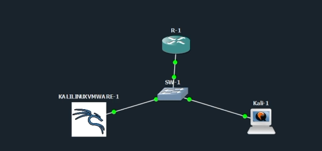
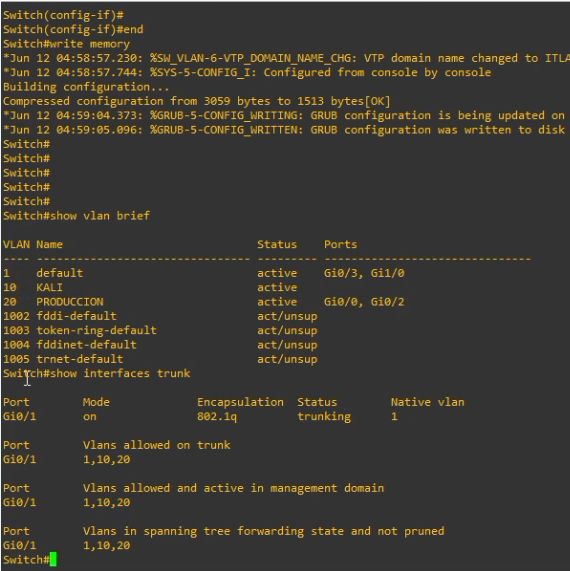
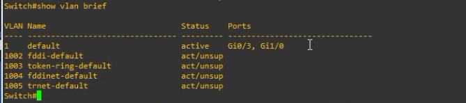
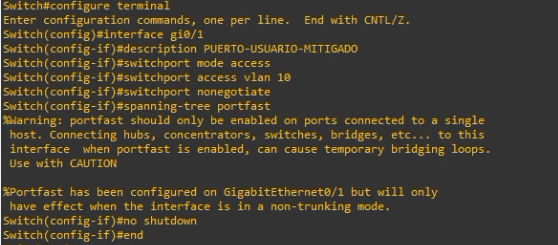

# VTP Attacks - Agregar y borrar VLANs

**Estudiante:** Michael David Robles Fermín  
**Matrícula:** 2025-0845  
**Asignación:** Networking - Seguridad de Redes  
**Repositorio:** https://github.com/iClexi/VTP-Attack  
**Video:** PENDIENTE

## Descripción

Este repositorio contiene el script y las evidencias del laboratorio **VTP Attacks**, donde se demuestra cómo una configuración vulnerable de VTP permite agregar una VLAN no autorizada y posteriormente borrar la base de VLANs del switch dentro de un entorno controlado en GNS3.

El laboratorio fue realizado exclusivamente con fines académicos y en una topología autorizada.

## Objetivos

- Agregar una VLAN mediante mensajes VTP manipulados.
- Borrar la base de VLANs del switch mediante VTP.
- Evidenciar el impacto del ataque con comandos de verificación.
- Documentar contramedidas para reducir el riesgo.

## Topología



| Dispositivo | Rol | Interfaz | Detalle |
|---|---|---|---|
| R-1 | Router/gateway del laboratorio | Hacia SW1 | Segmento de red basado en la matrícula |
| SW1 | Switch vulnerable | Gi0/1 | Puerto troncal hacia Kali atacante |
| Kali Linux | Atacante | eth0 | Ejecuta `vtp-attack.py` y Yersinia |
| PC víctima/lab | Equipo conectado al switch | VLAN 20 | Evidencia el impacto sobre la red |

## VLANs usadas

| VLAN | Nombre | Uso |
|---|---|---|
| 1 | default | VLAN nativa/tráfico por defecto |
| 10 | KALI | Segmento del atacante/lab |
| 20 | PRODUCCION | Segmento de producción/víctima |
| 845 | LAB | VLAN agregada durante la prueba |

## Requisitos

- Kali Linux.
- GNS3 con switch Cisco IOSvL2 o equivalente.
- Python 3.
- Yersinia instalado.
- `tcpdump` instalado.
- Ejecutar el script con privilegios de root.

```bash
sudo apt update
sudo apt install -y python3 yersinia tcpdump
```

## Uso del script

```bash
sudo python3 scripts/vtp-attack.py
```

Parámetros usados en la demostración:

| Parámetro | Valor |
|---|---|
| Interfaz | eth0 |
| Dominio VTP | ITLA |
| Versión VTP | 1 |
| Modo VTP vulnerable | server |
| Puerto vulnerable | Gi0/1 en trunk |
| VLAN agregada | 845 |
| Nombre VLAN | LAB |

## Evidencias rápidas

### Estado inicial



### VLAN agregada


### VLANs borradas



### Mitigación



## Contramedidas principales

- Usar `vtp mode transparent` o deshabilitar VTP cuando no sea necesario.
- Implementar VTP versión 3.
- Configurar contraseña VTP.
- Definir explícitamente el servidor primario VTP.
- Evitar puertos troncales hacia equipos de usuario.
- Configurar puertos finales como `switchport mode access` y `switchport nonegotiate`.
- Limitar VLANs permitidas en enlaces troncales reales.

## Documentación

La documentación técnica profesional se encuentra en:

- [`docs/Documentacion-Tecnica-Profesional.docx`](docs/Documentacion-Tecnica-Profesional.docx)
- [`docs/Documentacion-Tecnica-Profesional.pdf`](docs/Documentacion-Tecnica-Profesional.pdf)

## Autor

**Michael David Robles Fermín**  
**Matrícula:** 2025-0845
