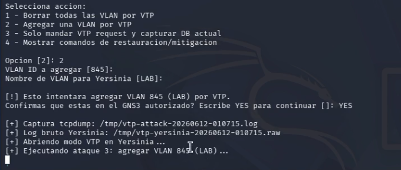
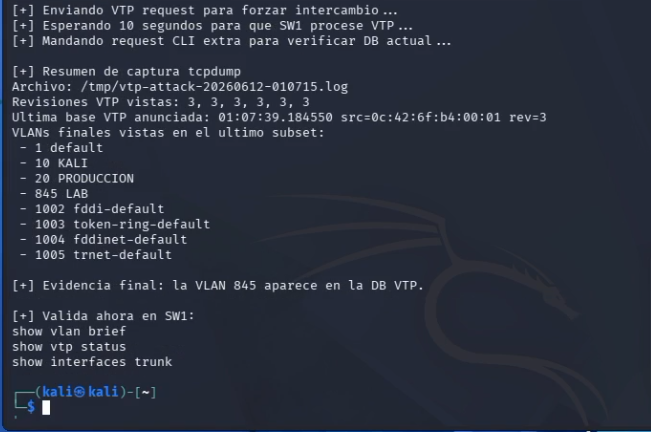
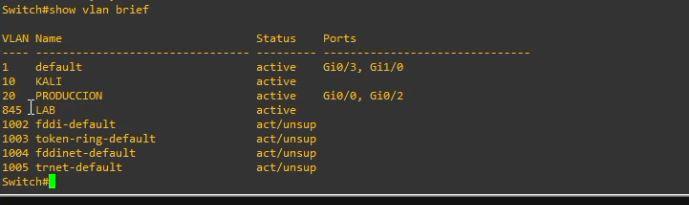
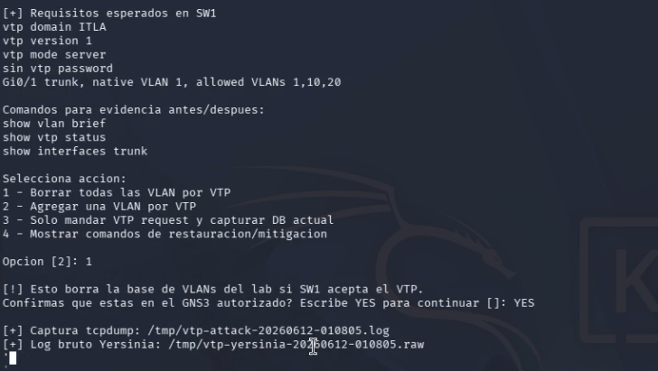
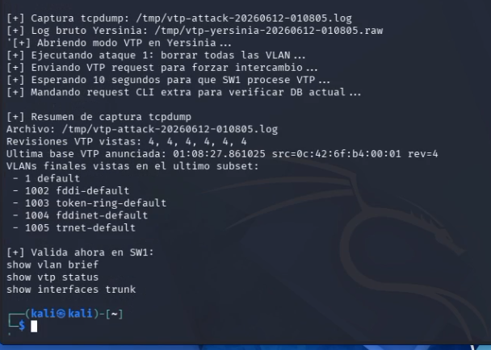
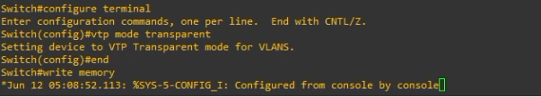
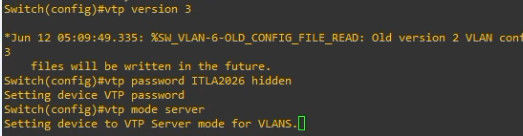
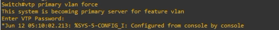

# How-To: VTP Attacks - Agregar y borrar VLANs

> Laboratorio académico en GNS3 para demostrar cómo una configuración vulnerable de VTP permite agregar una VLAN y borrar VLANs dentro de un dominio VTP autorizado.

**Estudiante:** Michael David Robles Fermín  
**Matrícula:** 2025-0845  
**Repositorio:** https://github.com/iClexi/VTP-Attack  
**Video:** https://youtu.be/GcTutdd2TME

---

## 1. Objetivo rápido

Este repositorio explica cómo ejecutar el script `vtp-attack.py` para:

1. Agregar la VLAN `845` al switch SW1 mediante VTP.
2. Borrar la base de VLANs del laboratorio mediante VTP.
3. Aplicar contramedidas para evitar que un equipo no confiable modifique VLANs.

---

## 2. Topología utilizada


| Equipo | Rol | Detalle |
|---|---|---|
| R-1 | Router/gateway | Conectado a SW1 |
| SW1 | Switch vulnerable | VTP domain `ITLA`, versión 1, modo server |
| Kali Linux | Atacante | Ejecuta `vtp-attack.py` usando `eth0` |
| Equipo víctima/lab | Host conectado al switch | Segmento de producción |

---

## 3. Requisitos

En Kali Linux instala lo necesario:

```bash
sudo apt update
sudo apt install -y python3 yersinia tcpdump
```

El script debe ejecutarse como root:

```bash
sudo python3 vtp-attack.py
```

---

## 4. Configuración vulnerable esperada en SW1

Antes de ejecutar el ataque, SW1 debe aceptar VTP en el dominio del laboratorio y el puerto hacia Kali debe estar en trunk.

```cisco
vtp domain ITLA
vtp version 1
vtp mode server
no vtp password

interface gi0/1
 switchport mode trunk
 switchport trunk native vlan 1
 switchport trunk allowed vlan 1,10,20
 no shutdown
```

Valida el estado inicial:

```cisco
show vlan brief
show interfaces trunk
show vtp status
```

Evidencia:


---

## 5. How-To: agregar una VLAN por VTP

Ejecuta el script desde Kali:

```bash
sudo python3 vtp-attack.py
```

Responde los parámetros así:

```text
Interfaz conectada a SW1 [eth0]: ENTER
Opcion [2]: 2
VLAN ID a agregar [845]: ENTER
Nombre de VLAN para Yersinia [LAB]: ENTER
Confirma que estas en el GNS3 autorizado? Escribe YES para continuar []: YES
```

Evidencias:





Verifica en SW1:

```cisco
show vlan brief
```

Resultado esperado:



---

## 6. How-To: borrar VLANs por VTP

Ejecuta nuevamente el script:

```bash
sudo python3 vtp-attack.py
```

Selecciona la opción de borrado:

```text
Interfaz conectada a SW1 [eth0]: ENTER
Opcion [2]: 1
Confirma que estas en el GNS3 autorizado? Escribe YES para continuar []: YES
```

Evidencias:





Verifica en SW1:

```cisco
show vlan brief
```

Resultado esperado:


---

## 7. How-To: mitigar el ataque

### Opción A: colocar VTP en modo transparent

```cisco
enable
configure terminal
vtp mode transparent
end
write memory
```



### Opción B: usar VTP versión 3 con contraseña y servidor primario

```cisco
enable
configure terminal
vtp version 3
vtp password ITLA2026 hidden
vtp mode server
end
vtp primary vlan force
write memory
```





### Opción C: evitar trunk hacia equipos de usuario

```cisco
enable
configure terminal
interface gi0/1
 description PUERTO-USUARIO-MITIGADO
 switchport mode access
 switchport access vlan 10
 switchport nonegotiate
 spanning-tree portfast
 no shutdown
end
write memory
```


---

## 8. Documentación técnica profesional

La documentación completa está en:

- [`docs/Documentacion-Tecnica-Profesional.pdf`](docs/Documentacion-Tecnica-Profesional.pdf)

---

## 9. Estructura del repositorio

```text
.
├── README.md
├── README.txt
├── vtp-attack.py
├── enlaces.txt
├── docs/
│   ├── Documentacion-Tecnica-Profesional.docx
│   └── Documentacion-Tecnica-Profesional.pdf
└── images/
    ├── vtp_01_topologia.png
    ├── vtp_02_estado_inicial_vlan_trunk.png
    └── ...
```

---

## 10. Aviso académico

Este material fue realizado exclusivamente en un laboratorio controlado de GNS3 para fines académicos. No debe ejecutarse en redes reales ni en infraestructura sin autorización.
